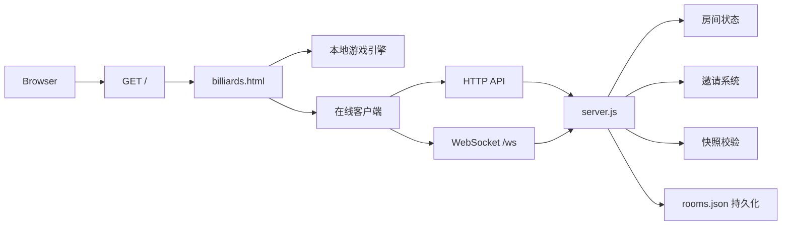
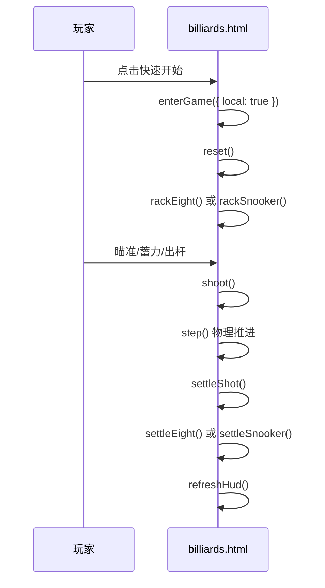
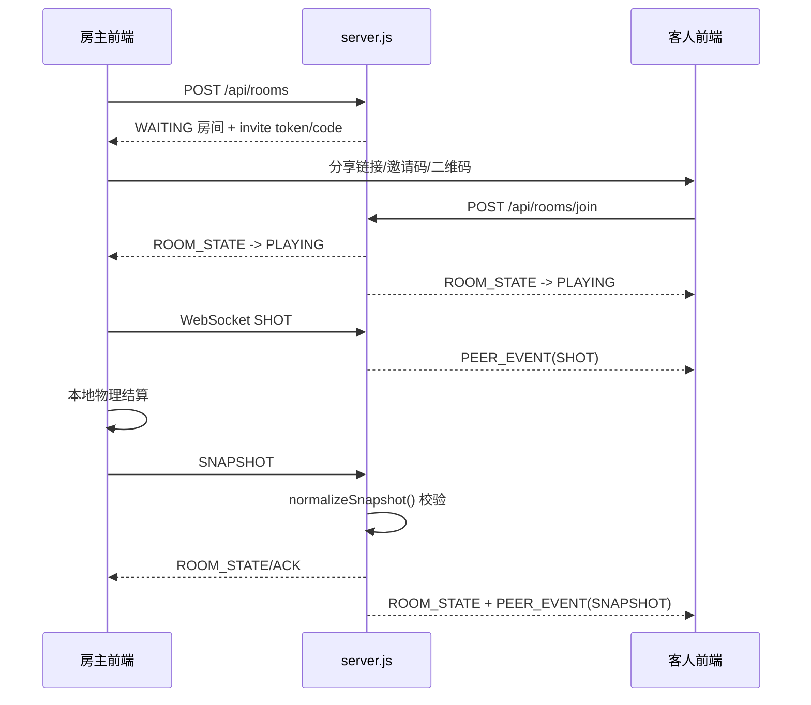

# Code Wiki

## 1. 文档目标

本文档用于帮助开发者快速理解该仓库的代码组织方式、核心运行机制与二次开发入口。相比 `README.md` 更侧重代码实现视角，重点回答以下问题：

- 这个项目是如何组织的
- 前后端分别承担什么职责
- 在线对局是如何同步和校验的
- 哪些函数和状态是核心
- 项目如何运行、测试与部署

---

## 2. 项目概览

这是一个零构建的网页台球项目，支持两种玩法：

- 中式八球
- 斯诺克

同时支持两种使用模式：

- 本地双人模式：同一设备上进行双人对局
- 邀请制在线模式：通过邀请码、邀请链接或二维码加入在线房间

项目采用非常轻量的单仓库实现：

- 前端：`billiards.html`
  - 单文件页面，包含 UI、Canvas 渲染、输入处理、物理仿真、规则结算、在线客户端逻辑、i18n 与设置管理
- 后端：`server.js`
  - 原生 Node.js HTTP 服务 + WebSocket 服务
  - 负责房间、邀请、鉴权边界、在线同步、断线恢复与持久化

这意味着它本质上是一个“小型单体应用”：

- 前端承载绝大多数游戏逻辑
- 后端不负责做完整物理运算，而是承担房间协调和权威状态校验

---

## 3. 技术栈

### 3.1 运行时与依赖

- Node.js 24+
- 原生 `node:http`
- `ws`
- `qrcode`

### 3.2 前端技术

- 单 HTML 文件页面
- 原生 DOM API
- Canvas 2D 渲染
- 原生 WebSocket
- 原生 `fetch`
- 无前端构建工具

### 3.3 测试技术

- Node Test Runner
- Playwright

### 3.4 部署相关

- Docker
- Nginx 反向代理示例配置

---

## 4. 仓库结构

```text
.
├── billiards.html
├── server.js
├── package.json
├── package-lock.json
├── Dockerfile
├── game-proxy.conf
├── README.md
├── docs/
│   ├── code-wiki.md
│   └── superpowers/specs/
│       └── 2026-08-26-billiards-product-ux-design.md
└── test/
    ├── billiards-ui.test.js
    ├── product-ux.test.js
    └── server.test.js
```

### 4.1 关键文件说明

#### `billiards.html`

项目的前端核心文件，也是游戏主程序。主要包含：

- 产品首页与进入流程
- 设置与中英文切换
- 本地模式状态机
- 在线模式客户端
- 台球物理模拟
- 中式八球与斯诺克规则结算
- Canvas 绘制
- 鼠标/触摸输入处理
- 音效与氛围音

#### `server.js`

项目的后端核心文件。主要包含：

- HTTP 路由处理
- WebSocket 协议处理
- 匿名身份 Cookie
- 房间创建、加入、取消、离开
- 邀请码、邀请链接与二维码
- 在线快照校验
- 断线暂停与重连恢复
- 房间持久化与恢复

#### `test/server.test.js`

偏协议与服务端一致性测试，覆盖：

- 匿名身份
- 房间状态转换
- 邀请预览
- 权限边界
- WebSocket 回合与快照校验
- 重连恢复
- 持久化恢复

#### `test/billiards-ui.test.js`

偏前端局部交互行为测试，重点验证：

- 本地玩法进入与回退
- 自由球放置确认流程
- 本地与在线模式切换后的 UI 状态

#### `test/product-ux.test.js`

偏产品旅程和端到端体验测试，重点验证：

- 首页三入口
- 邀请链接加入
- 移动端与桌面端布局
- 双浏览器联机同步
- 掉线暂停与重连
- 重开流程

---

## 5. 整体架构

### 5.1 架构总览



### 5.2 设计特点

#### 前端重

游戏引擎、规则判断、渲染和输入都在前端。这样做的好处是：

- 本地模式无需后端参与
- 在线模式时仍可复用同一套本地结算逻辑
- 部署简单，只有一个 HTML 页面和一个 Node 服务

代价是：

- `billiards.html` 体量较大
- 状态较多，维护时需要谨慎
- 代码分层主要靠“逻辑区域”而不是文件拆分

#### 服务端轻权威

服务端并不执行完整台球物理，只做以下权威控制：

- 房间和成员状态管理
- 回合约束
- 动作幂等
- 快照结构与数值范围校验
- 房间断线与生命周期控制

这种模型可以概括为：

`动作转发 + 结算快照校验`

#### 单页直出

没有 Webpack、Vite、React、Vue 等工具链。根路径直接返回 `billiards.html`，因此：

- 启动成本很低
- 调试路径短
- 静态资源与页面耦合度较高

---

## 6. 主要运行流程

### 6.1 本地模式流程



### 6.2 在线模式流程



### 6.3 断线重连流程

- 某一方 WebSocket 断开
- 服务端将房间从 `PLAYING` 切换为 `PAUSED`
- 另一方看到网络遮罩与重连倒计时
- 宽限期内重连成功则恢复为 `PLAYING`
- 超时未恢复则房间进入 `CANCELLED`

---

## 7. 服务端架构：`server.js`

## 7.1 核心职责

`server.js` 是整个系统的“协作与校验中心”，而不是物理引擎。它主要解决以下问题：

- 给用户分配匿名身份
- 管理在线房间生命周期
- 提供邀请预览与二维码
- 通过 WebSocket 广播动作
- 约束回合与操作合法性
- 校验结算快照
- 跟踪在线状态与断线重连
- 持久化未终局的房间状态

### 7.2 核心数据结构

#### `config`

由 `createGameServer(options)` 统一组装的运行配置，包含：

- 监听端口
- 静态目录
- 数据目录
- 是否信任代理
- 允许的 Origin
- 邀请过期时间
- 重连宽限期
- 清理任务间隔
- 是否启用持久化

#### `rooms`

`Map<roomId, room>`，整个服务端的主状态存储。

每个 `room` 保存：

- 房间 ID
- 比赛 ID 与当前 rack ID
- 邀请 token 与 code
- 玩法模式
- 房间状态
- 玩家信息
- 当前回合
- 待结算击球
- 最新权威快照
- 双方确认请求
- 创建和更新时间

#### `userRooms`

`Map<userId, roomId>`，用于从匿名身份快速定位用户当前所在房间。

#### `sockets`

`Map<roomId:role, Set<WebSocket>>`，用于按房间和角色维护活跃连接。

#### `reconnectTimers`

记录断线角色对应的超时定时器，用于控制重连宽限期。

#### `rateBuckets`

服务端自实现的轻量限流桶，按 IP 或用户维度限制请求频率。

### 7.3 房间状态机

常见状态包括：

- `WAITING`
- `PLAYING`
- `PAUSED`
- `FINISHED`
- `CANCELLED`
- `EXPIRED`

典型流转：

```text
WAITING -> PLAYING -> PAUSED -> PLAYING
WAITING -> CANCELLED
WAITING -> EXPIRED
PLAYING -> FINISHED
PLAYING/PAUSED/FINISHED -> CANCELLED
```

### 7.4 关键函数说明

#### `createGameServer(options)`

服务端工厂函数，是整个后端的入口。

职责：

- 组装配置
- 初始化内存状态
- 创建 HTTP 服务
- 创建 WebSocket 服务
- 绑定心跳、清理和持久化逻辑

它返回一个可测试的对象：

- `listen()`
- `close()`
- `server`

这也是测试中能够直接拉起服务实例的基础。

#### `identity(req, res)`

匿名身份管理函数。

职责：

- 从 Cookie 中读取 `user_id`
- 若不存在或非法则生成新 ID
- 在合适条件下写回 `HttpOnly` Cookie

这是项目身份体系的基础。项目不依赖账户系统，而是用匿名身份维持房间成员关系。

#### `publicRoom(room, userId)`

将内部房间对象转换为对当前用户可见的公开房间状态。

这是非常关键的边界函数，作用是：

- 隐藏 `userId`
- 对非房主隐藏邀请密钥
- 只暴露前端真正需要的字段

它实际上承担了“服务端视图模型”的职责。

#### `createRoom(userId, body)`

创建在线房间。

主要做：

- 检查用户是否已有活跃房间
- 校验模式和昵称
- 生成房间、邀请码、邀请 token
- 初始化等待态房间

#### `joinRoom(userId, body)`

玩家 2 加入房间。

关键约束：

- 不能自己加入自己创建的房间
- 邀请必须存在且未过期
- 房间必须仍处于 `WAITING`
- 用户不能已有其他活跃房间

加入成功后会把房间切换为：

- `PLAYING`
- 初始回合为 `PLAYER_1`

#### `normalizeSnapshot(room, payload, pending)`

这是服务端最关键的“权威校验”函数。

它不做物理运算，但会严格验证：

- schema 版本
- 模式与 rack 是否匹配
- 球数量与球编号是否正确
- 坐标是否在桌面合法范围内
- 球是否仍在运动
- 玩家分数、犯规、球组是否合法
- 回合与 `next_turn` 是否一致
- 斯诺克目标状态是否合法
- `placement` 是否与 `game_state` 一致
- 是否只有终局快照可以声明 `FINISHED`

该函数体现了项目在线同步的核心设计思想：

- 客户端负责计算
- 服务端负责拒绝不合理状态

#### `handleGameMessage(ws, raw)`

WebSocket 消息主分发函数。

负责处理：

- `SHOT`
- `PLACEMENT`
- `SNAPSHOT`
- `RESTART_*`
- `STALEMATE_*`
- `REMATCH_*`

其核心能力包括：

- 校验消息格式
- 校验 `action_id`
- 幂等去重
- 校验回合和房间状态
- 更新房间状态版本
- 广播 `PEER_EVENT`
- 回发 `ACK`

#### `addSocket(ws, room, role)` 与 `removeSocket(ws)`

管理玩家在线状态。

当连接建立时：

- 标记玩家在线
- 若原房间因掉线暂停且双方都在线，则恢复为 `PLAYING`

当连接关闭时：

- 标记玩家离线
- 若此前是 `PLAYING`，改为 `PAUSED`
- 启动重连超时定时器
- 超时后将房间标记为 `CANCELLED`

#### `persist()` / `restore()`

负责房间持久化与恢复。

特点：

- 目录不存在时自动创建
- 写文件采用临时文件 + 原子重命名
- 进程重启后可恢复未终局房间
- 恢复时会将 `PLAYING`/`READY` 房间转成 `PAUSED`

### 7.5 HTTP 接口分层

#### 静态资源

- `GET /`
- `GET /assets/*`

职责：

- 返回页面或资源
- 防止目录穿越
- 设置 CSP 和基础安全头

#### 健康检查

- `GET /healthz`

职责：

- 返回进程 uptime
- 返回当前房间数量

#### 会话与邀请

- `GET /api/session`
- `GET /api/invites/:token`
- `GET /api/invites/:token/qr.svg`

职责：

- 提供匿名身份上下文
- 提供加入前预览信息
- 生成同源二维码

#### 房间管理

- `POST /api/rooms`
- `POST /api/rooms/join`
- `GET /api/rooms/:room_id`
- `POST /api/rooms/:room_id/leave`
- `POST /api/rooms/:room_id/cancel`
- `POST /api/rooms/:room_id/invite`

职责：

- 创建与加入房间
- 拉取成员可见状态
- 退出与取消
- 重发邀请

### 7.6 WebSocket 协议设计

服务端将 WebSocket 作为“实时动作通道”。

#### 服务端发送

- `CONNECTED`
- `ROOM_STATE`
- `PRESENCE`
- `PEER_EVENT`
- `ACK`
- `ERROR`

#### 客户端发送

- `SHOT`
- `PLACEMENT`
- `SNAPSHOT`
- 各类双边决策请求与确认消息

#### 协议特点

- 每次动作必须带 `action_id`
- 服务端保存最近的动作集合用于幂等去重
- 击球被接纳后先形成 `pendingShot`
- 只有发起该杆击球的一方才能提交对应 `SNAPSHOT`

### 7.7 服务端安全性设计

项目虽然轻量，但安全边界相对完整：

- Cookie 使用 `HttpOnly`
- 支持代理 HTTPS 场景下的 `Secure` Cookie
- API 与 WebSocket 都会检查 Origin
- 自实现限流
- 静态资源访问防路径穿越
- HTML 与资源返回带 `Content-Security-Policy`
- WebSocket 有心跳机制

---

## 8. 前端架构：`billiards.html`

### 8.1 前端职责划分

`billiards.html` 可以视为六层逻辑混合在一个文件中的实现：

- 产品壳层
- 游戏状态层
- 在线客户端层
- 规则与结算层
- 物理与渲染层
- 输入与交互层

虽然是单文件，但内部已经按逻辑区域组织，阅读时建议按照这些层次理解。

### 8.2 全局状态模型

#### 核心游戏状态

- `balls`
- `cue`
- `state`
- `aimAngle`
- `power`
- `shots`
- `mode`
- `turn`
- `players`
- `isBreak`
- `snookerTarget`
- `clearanceIndex`
- `placement`
- `matchWinner`
- `rackBreaker`

#### 产品态与交互态

- `gameActive`
- `homeMode`
- `settings`
- `matchStartedAt`
- `matchStats`
- `coarsePointer`
- `toast`
- `effects`

#### 在线态

`online` 是前端在线模式的核心状态容器，保存：

- 当前房间
- WebSocket 实例
- 重连定时器与次数
- 待确认动作
- 已应用事件集合
- 当前是否锁定输入
- 当前是否拥有快照提交权
- 当前 rack ID
- 待处理的双边决策 ID

它实际上承担了一个轻量“在线会话状态机”的角色。

### 8.3 前端模块分区

#### A. 设置与国际化

关键函数：

- `loadSettings()`
- `saveSettings()`
- `t(key, ...args)`
- `applyI18n()`

职责：

- 从 `localStorage` 读取设置
- 保存声音、辅助线、振动、语言偏好
- 用同一套键值表驱动中英文 UI

这是整个前端“产品化”程度较高的一部分，因为大量 UI 文案都由它统一控制。

#### B. 首页与进入流程

关键函数：

- `showHome()`
- `enterGame()`
- `parseInviteInput()`
- `previewInvite()`
- `loadInviteLanding()`
- `userFacingError()`

职责：

- 管理首页三入口
- 处理邀请链接落地页
- 控制表单显隐和文案
- 将服务端错误转成用户可理解的反馈

#### C. 在线客户端

关键函数：

- `api()`
- `setOnlineRoom()`
- `renderOnlineLobby()`
- `createOnline()`
- `joinOnline()`
- `connectOnline()`
- `sendOnline()`
- `handleOnlineMessage()`
- `handlePeerEvent()`
- `requestShot()`
- `requestPlacement()`
- `snapshotPayload()`
- `applySnapshot()`
- `requestBilateral()`
- `syncPendingDecision()`
- `restoreOnlineSession()`

这部分是前端在线模式的主干。

关键思想：

- 前端既是玩家 UI，也是 WebSocket 协议客户端
- 在线房间状态来自服务端 `ROOM_STATE`
- 击球动画与本地规则仍在前端执行
- 最终结算结果由 `SNAPSHOT` 提交给服务端校验

#### D. 摆球与重置

关键函数：

- `makeBall()`
- `rackEight()`
- `rackSnooker()`
- `reset()`

职责：

- 构造球对象
- 初始化中式八球球阵
- 初始化斯诺克球阵
- 重置比赛统计、状态与 UI

`reset()` 是前端新局初始化的主入口。

#### E. HUD 与界面反馈

关键函数：

- `refreshHud()`
- `showTurnBanner()`
- `renderNetworkState()`
- `showToast()`

职责：

- 更新玩家面板
- 更新目标球或比分信息
- 更新在线状态和重连信息
- 更新房间和 rack 的 DOM dataset

这些 dataset 也被测试代码大量使用，例如：

- `data-room-status`
- `data-state-version`
- `data-rack-id`

#### F. 规则与结算

关键函数：

- `beginBallInHand()`
- `confirmPlacement()`
- `registerEightFoul()`
- `settleEightBreak()`
- `settleEight()`
- `settleSnooker()`
- `settleShot()`
- `finishMatch()`
- `renderResult()`

职责：

- 执行球权转移
- 判定自由球
- 处理八球犯规与胜负
- 处理斯诺克得分和清彩
- 生成结算结果界面

这是前端业务最核心也最复杂的区域。

#### G. 物理仿真

关键函数：

- `step(dt)`
- `potBall()`
- `offTableBall()`
- `allStopped()`
- `shoot()`

职责：

- 更新球位置与速度
- 检测落袋
- 处理台边碰撞
- 处理球与球之间碰撞
- 记录本杆事实信息 `shotFacts`

`shotFacts` 很重要，它相当于“本杆证据收集器”，用于后续规则结算，比如：

- 第一接触球
- 是否碰库
- 是否有球离台
- 是否白球过线
- 开球是否合法

#### H. 输入与桌面交互

关键函数：

- `toLocal()`
- 指针事件处理器
- `legalPlacement()`
- `updatePlacement()`
- `placementGuideText()`

职责：

- 把屏幕坐标映射到球桌坐标
- 处理鼠标和触摸瞄准
- 处理自由球拖动与确认

### 8.4 关键函数深度说明

#### `setOnlineRoom(room)`

这是前端在线同步的中心函数。

职责：

- 切换到最新房间状态
- 识别是否进入终局房间
- 识别 rack 是否变化
- 对新 rack 触发 `reset()`
- 若有 `latest_snapshot` 则恢复本地游戏状态
- 若有 `pending_shot` 则安排补播
- 同步双边决策弹窗

可以把它理解为：

“前端根据服务端房间状态重建本地游戏现场”的主入口。

#### `connectOnline()`

WebSocket 连接生命周期管理函数。

职责：

- 建立 `/ws?room_id=...` 连接
- 处理重连退避
- 处理断线后的 pending reject
- 维护 HUD 中的重连状态

这部分实现了较完整的重连体验，而不是简单地提示失败。

#### `handlePeerEvent(event)`

处理对端广播来的实时动作。

处理两类核心事件：

- `SHOT`
- `PLACEMENT`

它会直接驱动本地动画或自由球确认，因此实现的是：

- “协议事件 -> 本地引擎动作”

#### `snapshotPayload()`

将当前前端状态转换为服务端可校验的快照对象。

包含：

- 球桌上所有球的状态
- 玩家得分/犯规/球组
- 当前回合
- 当前玩法与 rack
- 自由球状态
- 终局状态

这意味着前端具备把整个对局还原为可序列化状态的能力。

#### `applySnapshot(s)`

将服务端认可的快照重新应用到本地。

作用包括：

- 校验快照结构
- 重新初始化球桌
- 恢复球位置
- 恢复比分、回合与状态
- 恢复终局面板

这是在线同步最终一致性的关键。

#### `settleEight()` 与 `settleSnooker()`

这两个函数分别负责两种玩法的规则裁定。

其中：

- `settleEight()` 更偏“犯规与球组推进”
- `settleSnooker()` 更偏“目标球状态与得分推进”

它们都基于 `shotFacts` 和 `shotPots` 来做判定，因此物理层和规则层之间通过“事实记录”解耦。

### 8.5 前端状态机

核心 `state` 包括：

- `aim`
- `charge`
- `roll`
- `placement`
- `decision`
- `over`

可粗略理解为：

```text
aim -> charge -> roll -> aim
aim -> roll -> placement -> aim
aim -> decision -> aim
aim -> roll -> over
```

该状态机既驱动 UI，也影响可用输入和网络动作。

---

## 9. 前后端协作边界

### 9.1 前端负责什么

- UI 呈现
- 输入处理
- 球桌物理
- 规则结算
- 快照生成
- 本地与在线共用的游戏引擎

### 9.2 服务端负责什么

- 身份与房间管理
- 协议编排
- 回合权威
- 快照合法性校验
- 在线状态管理
- 持久化与恢复

### 9.3 为什么这样分工

这种分工兼顾了：

- 实现简单
- 本地模式复用率高
- 在线模式服务端压力小

同时也带来一些天然约束：

- 前端是规则真源
- 服务端只能做结构和边界校验，不能完全防作弊
- 前端与服务端必须保持快照 schema 一致

---

## 10. 依赖关系分析

### 10.1 代码依赖

#### `server.js` 依赖

- Node 内置模块
  - `node:http`
  - `node:crypto`
  - `node:fs/promises`
  - `node:path`
  - `node:url`
- 第三方
  - `ws`
  - `qrcode`

#### `billiards.html` 依赖

- 浏览器原生能力
  - DOM
  - Canvas 2D
  - WebSocket
  - `fetch`
  - `localStorage`
  - `navigator.share`
  - `navigator.vibrate`
  - Web Audio API

### 10.2 运行期依赖关系

```mermaid
flowchart TD
    A[billiards.html] --> B[/api/session]
    A --> C[/api/rooms]
    A --> D[/api/rooms/join]
    A --> E[/api/rooms/:id]
    A --> F[/api/invites/:token]
    A --> G[/api/invites/:token/qr.svg]
    A --> H[/ws]
    H --> I[房间状态机]
    I --> J[latest_snapshot]
    J --> A
```

### 10.3 测试依赖关系

- `server.test.js`
  - 直接依赖 `createGameServer()`
  - 通过真实 HTTP 和 WebSocket 验证服务端行为
- `billiards-ui.test.js`
  - 通过 Playwright 验证页面局部交互
- `product-ux.test.js`
  - 通过 Playwright 验证端到端双客户端流程

---

## 11. 项目运行方式

### 11.1 安装依赖

```bash
npm install
```

### 11.2 本地启动

```bash
npm start
```

默认地址：

```text
http://localhost:8088
```

### 11.3 常用脚本

```bash
npm start
npm test
npm run test:ui
```

含义：

- `npm start`：启动服务
- `npm test`：运行全部测试
- `npm run test:ui`：运行前端 UI 与产品旅程测试

### 11.4 环境变量

| 变量 | 默认值 | 作用 |
| --- | --- | --- |
| `PORT` | `8088` | 服务监听端口 |
| `PUBLIC_DIR` | 项目根目录 | 静态资源目录 |
| `DATA_DIR` | `./data` | 房间持久化目录 |
| `TRUST_PROXY` | `false` | 是否信任代理头 |
| `ALLOWED_ORIGINS` | 空 | 允许的 Origin 列表 |

### 11.5 生产部署

#### 直接运行

```bash
npm ci --omit=dev
PORT=8088 NODE_ENV=production npm start
```

#### Docker

```bash
docker build -t billiards .
docker run -d --name billiards -p 8088:8088 -v billiards-data:/app/data billiards
```

#### Nginx 反代

可参考 `game-proxy.conf`，其中已经包含：

- `Upgrade`
- `Connection`
- `proxy_http_version 1.1`

这对 WebSocket 转发是必要的。

---

## 12. 测试策略与覆盖面

### 12.1 服务端测试关注点

`test/server.test.js` 重点覆盖：

- 匿名身份 Cookie 行为
- 代理 HTTPS 下 `Secure` Cookie
- 创建与加入房间
- 邀请预览最小字段暴露
- 房间隐私边界
- 回合约束
- WebSocket 幂等
- 快照严格校验
- 掉线暂停与恢复
- 断线后 pending shot 行为
- 持久化恢复

### 12.2 前端与产品测试关注点

`test/billiards-ui.test.js` 与 `test/product-ux.test.js` 重点覆盖：

- 首页三入口可用性
- 邀请链接直接落地加入
- 桌面与移动端布局矩阵
- 自由球放置交互
- 在线对局同步
- 掉线与重连恢复
- 双边确认弹窗
- 页面无明显控制台错误

### 12.3 测试策略评价

这套测试设计比较贴近真实风险点：

- 服务端用协议级测试守住状态边界
- 前端用 Playwright 守住真实交互体验

对于此类轻量单体应用，这是性价比较高的测试方案。

---

## 13. 关键设计决策

### 13.1 单文件前端

优点：

- 部署极简
- 调试路径短
- 没有构建负担

缺点：

- 文件偏大
- 模块边界主要依赖约定
- 长期演进成本会上升

### 13.2 客户端结算 + 服务端校验

优点：

- 服务端负担轻
- 本地与在线逻辑高度复用
- 在线体验较流畅

缺点：

- 服务端不是强物理权威
- 需要前后端严格遵守快照结构
- 理论上抗作弊能力不如全服务端裁判

### 13.3 匿名身份体系

优点：

- 无需登录
- 进入成本低
- 适合朋友对战场景

缺点：

- 身份与设备/浏览器耦合
- 更适合轻量房间制产品，不适合复杂账户体系

---

## 14. 可维护性观察

### 14.1 当前优势

- 核心职责清晰
- 后端边界明确
- 测试覆盖实际风险
- 部署复杂度低

### 14.2 当前风险

- `billiards.html` 过于集中
- 全局变量较多
- 前端多个逻辑层耦合在同一文件
- 快照 schema 由前后端分别手写维护，存在双端漂移风险

### 14.3 建议的演进方向

如果未来继续扩展功能，可以优先考虑以下重构路径：

#### 第一阶段：逻辑拆分但保持零构建

将 `billiards.html` 中内联脚本逐步拆成原生 ES Modules，例如：

- `game-core.js`
- `rules-eight.js`
- `rules-snooker.js`
- `online-client.js`
- `ui-shell.js`

#### 第二阶段：抽取共享快照 schema

将快照字段定义、球 ID 集合、模式枚举等抽成共享模块，降低双端不一致风险。

#### 第三阶段：提升服务端权威度

若未来面向公开网络环境，可以继续增强：

- 更严格的动作与时间序列校验
- 更细粒度的快照差异检查
- 更强的审计日志

---

## 15. 开发者阅读建议

如果是第一次接触该仓库，推荐按以下顺序阅读：

1. `README.md`
2. `package.json`
3. `server.js`
4. `billiards.html`
5. `test/server.test.js`
6. `test/product-ux.test.js`

推荐的代码理解路径：

### 路径 A：先看在线协作

- `createGameServer()`
- `publicRoom()`
- `joinRoom()`
- `handleGameMessage()`
- `setOnlineRoom()`
- `connectOnline()`
- `snapshotPayload()`
- `applySnapshot()`

### 路径 B：先看本地游戏引擎

- `reset()`
- `rackEight()` / `rackSnooker()`
- `shoot()`
- `step()`
- `settleShot()`
- `settleEight()` / `settleSnooker()`

### 路径 C：先看产品体验

- `showHome()`
- `enterGame()`
- `renderOnlineLobby()`
- `refreshHud()`
- `renderNetworkState()`
- Playwright 测试文件

---

## 16. 一句话总结

这是一个以 `billiards.html` 为核心游戏引擎、以 `server.js` 为在线协作与权威校验中心的轻量单体台球项目。它最重要的实现特征不是“前后端分离”，而是“前端负责结算、服务端负责边界”，并通过 HTTP + WebSocket + 快照校验实现了本地与在线双模式统一。
